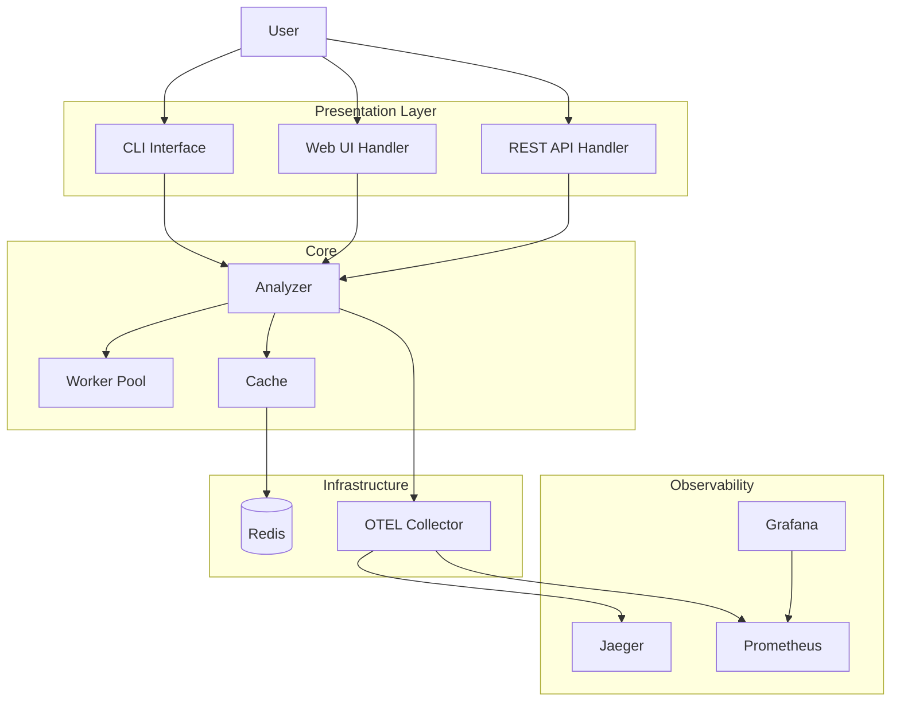
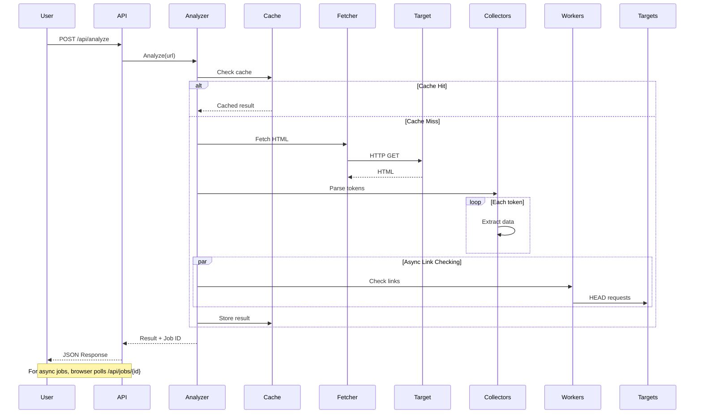
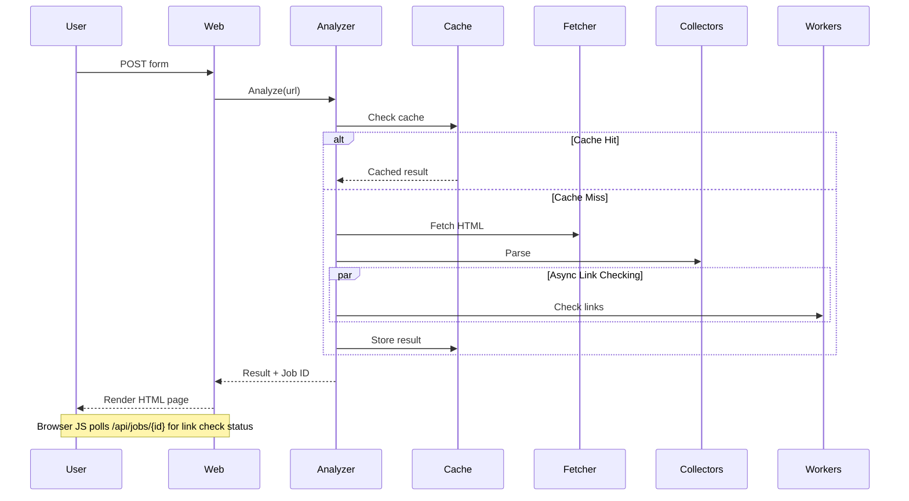
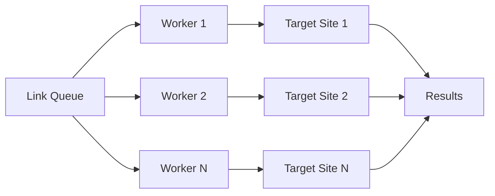
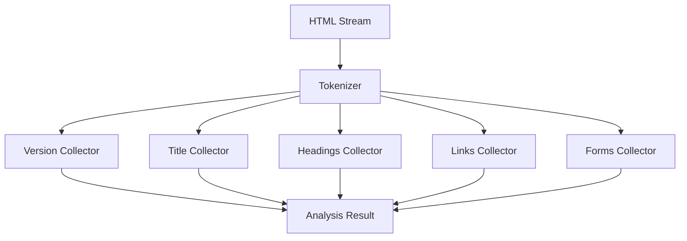
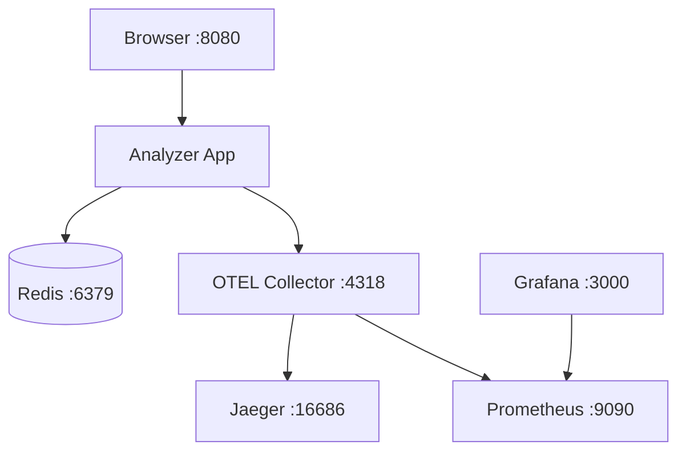
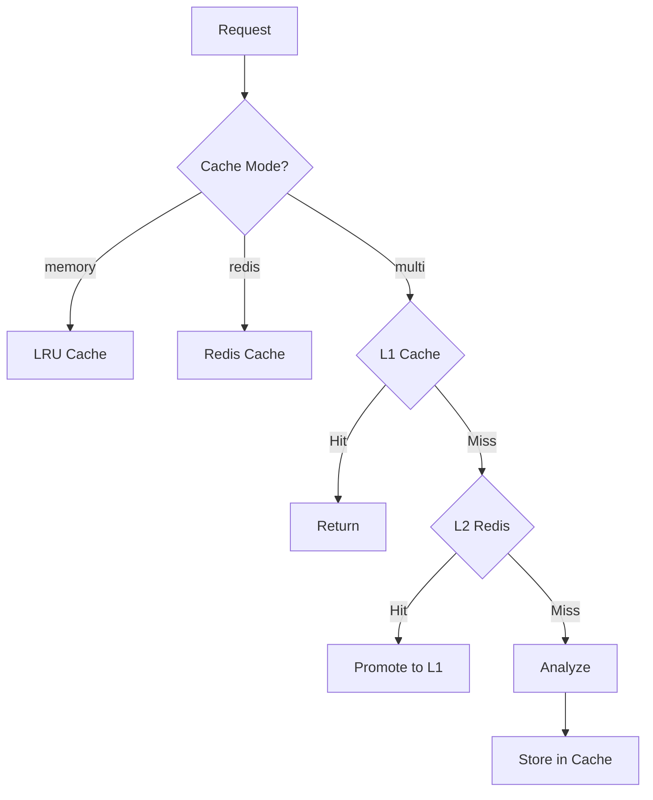

# Architecture Diagrams

## System Overview

**Note**: Web UI and REST API are **separate interfaces**, not layered. Both call the analyzer directly. Browser JS only polls `/api/jobs/{id}` for async link check results.

## Analysis Flow (REST API)

## Analysis Flow (Web UI)

## Worker Pool

## Collector Pattern

## Demo Infrastructure

## Caching Strategy

